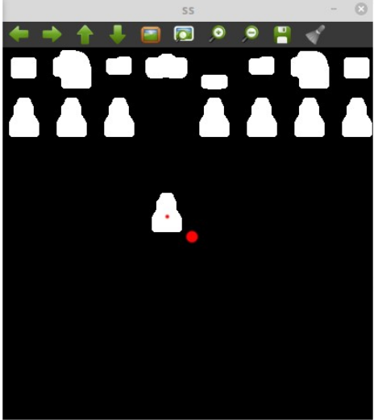
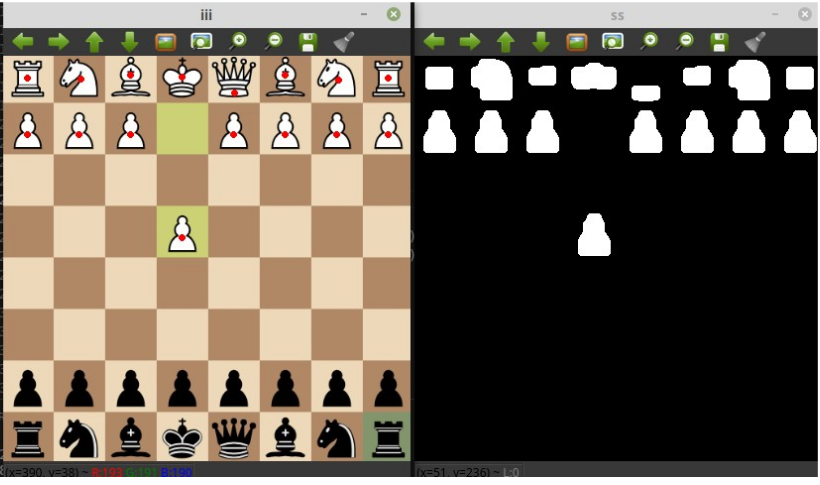
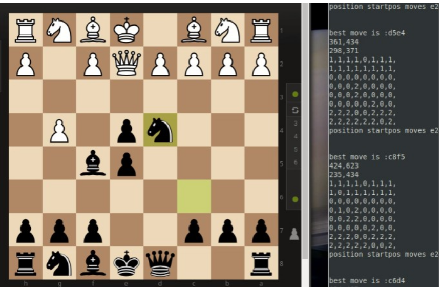

# Leemon is an advanced chess bot 

### About
- it uses classical computer vision techniques to identify chessboard and pieces

-- Story behind this project : My computer is pretty old and when i tried to code my own bot the first algorithms
came into my mind were time and resource consuming approaches such as SIFT ,CNN, HOG or DNN  but it should be fast
and resource efficient that i can run on my computer easily and effortlessly. So i created my own approach 
for chessboard and its pieces detection.It uses morphological transforms insted of feature based approaches.
So after a lot of experiments and research development process this project came into life.At this stage it is created for Windows (unfortunately) but there is older version i wrote few years ago that works in Linux but 
it needs a lot of fixes. I will back to that project later though.

- Details
- Written in C++ 
- OpenCV library used for image processing
 
*** Project is Cross_Platform but old Linux version needs some fixes ! (It will be added later)

### Project Demo 
#
#

### Documentation 

- Project structure and idea behind this algorithm might seem compilicated at first glance but it is fairly simple.

- 1. Threshold recorded image and get contours from it and calculate moments 
     As we can see it also identified center of chessboard

- 2. Center of every moment is middle point of corresponding piece

- 3. Last stage is refreshing old and new tables and waiting for opponent moves
     and passing moves to chess engine  i used stockfish but it could be your favorite one.
     Wait for engine responce get it and move the mouse

* TODO :
* -Add interrupt keys
* -Improve algorithm
* -Add GUI features

